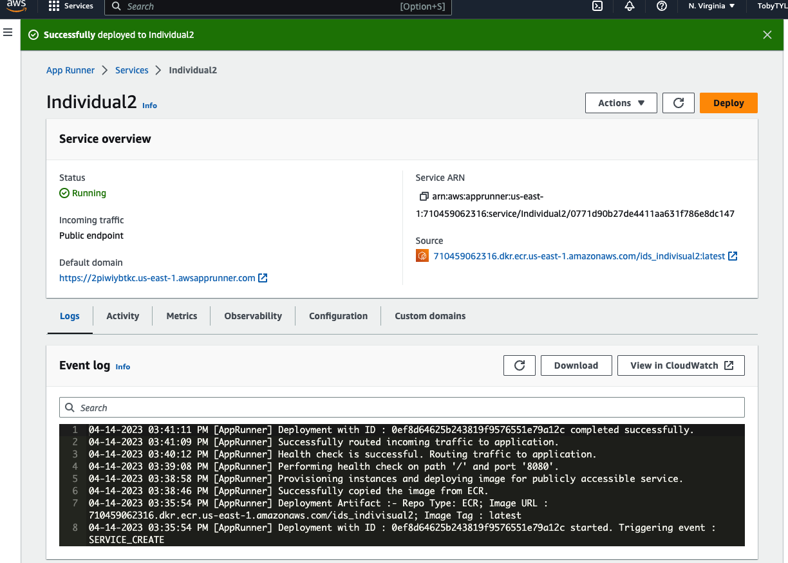

## Kubernetes examples

### Lab Minikube (based on official tutorial on https://kubernetes.io)

1.  Launch GitHub Codespace
2.  Run `minikube start` to start cluster
3.  Run `minikube dashboard --url` to view dashboard in a new terminal
4.  Hover over link and "follow link"
5.  Create a deployment:  `kubectl create deployment hello-node --image=registry.k8s.io/e2e-test-images/agnhost:2.39 -- /agnhost netexec --http-port=8080`
6. View deployment: `kubectl get deployments`
7. View pods:  `kubectl get pods`
8. Create service and expose it: `kubectl expose deployment hello-node --type=LoadBalancer --port=8080`
9. View services:  `kubectl get services`
10. Curl the url shown, for example: `curl http://192.168.49.2:31839` or change to your URL.
11. Cleanup
```bash
kubectl delete service hello-node
kubectl delete deployment hello-node
minikube stop
````

## Docker

`docker build .`
`docker image ls` #find image
`docker run -p 127.0.0.1:8080:8080 93fa55efa692` <replace with your image>

### Cloud9 + ECR + App Runner

  


* Clone repo into Cloud9 (pick a machine with decent size CPU and RAM if possible, but students should use micro)
* Add ssh keys to GitHub
* [resize to bigger disk](https://gist.github.com/wongcyrus/a4e726b961260395efa7811cab0b4516)
* Create virtualenv and add to bashrc and source
`python3 -m venv ~/.venv && echo 'source ~/.venv/bin/activate' >> ~/.bashrc && source ~/.bashrc`
* cd into checkout and run `make install`
* Preview running FastAPI app after running:  python main.py

## After pushing the image to ECR and deployed by App runner
